<h2>TensorFlow-FlexUNet-Image-Segmentation-Mixed-Brain-Tumor-MRI-Regenerated (2026/04/29)</h2>
Sarah T.  Arai 
Software Laboratory antillia.com  
This is the first experiment of Image Segmentation for <b>Mixed-Brain-Tumor-MRI-Regenerated</b> based on our <a href="./src/TensorFlowFlexUNet.py">TensorFlowFlexUNet</a> 
(TensorFlow Flexible UNet Image Segmentation Model for Multiclass) , 
and a 512x512 pixels PNG
<a href="https://drive.google.com/file/d/1Bk5abVxq3-XkA5d8J4UalO_VcyFUgih3/view?usp=sharing">
<b>Mixed-Brain-Tumor-MRI-Regenerated-ImageMask-Dataset.zip</b></a> with colorized masks 
(<a href="https://www.mit.edu/~amini/LICENSE.md">MIT</a>), which was derived by us from   
<a href="https://www.kaggle.com/datasets/wajeehaldeenaljunaid/mixed-brain-tumor-dataset">
<b>mixed_brain_tumor_dataset</b> 
<b>Brain Tumor MRI Segmentation Dataset (Balanced & Merged)</b> </a> on the kaggle.com.
  

<b>Actual Image Segmentation for Mixed-Brain-Tumor-MRI-Regenerated Images of 512x512 pixels </b> 
As shown below, the inferred masks predicted by our segmentation model trained by the dataset appear similar to the ground truth masks.
  
<b>class_color_map = {Glioma:yellow,  Meningioma:green, Pituitary: mazenta}
</b>
  
<table>
<tr>
<th>Input: image</th>
<th>Mask (ground_truth)</th>
<th>Prediction: inferred_mask</th>
</tr>
<tr>
<td>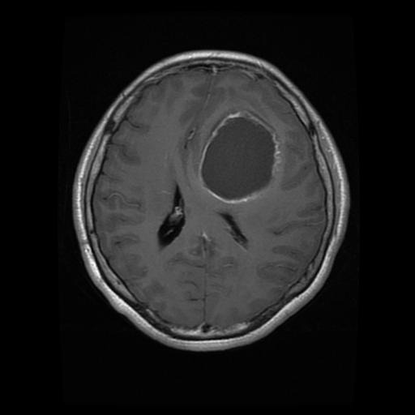</td>
<td>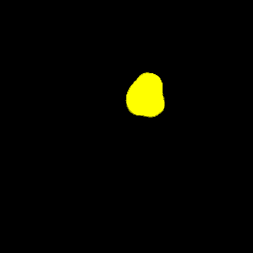</td>
<td>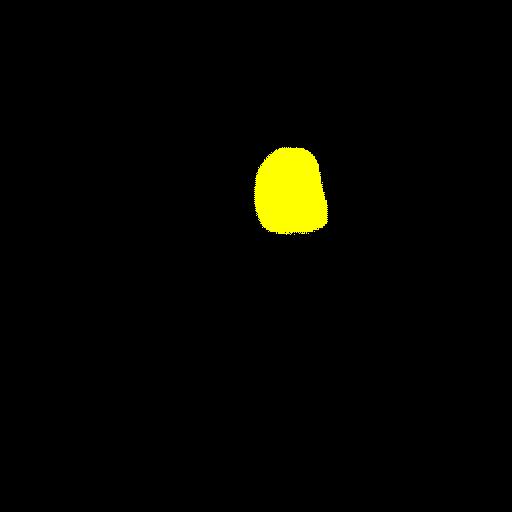</td>
</tr>

<tr>
<td>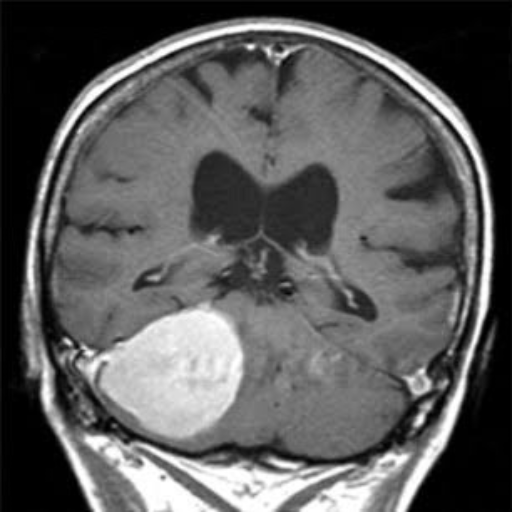</td>
<td>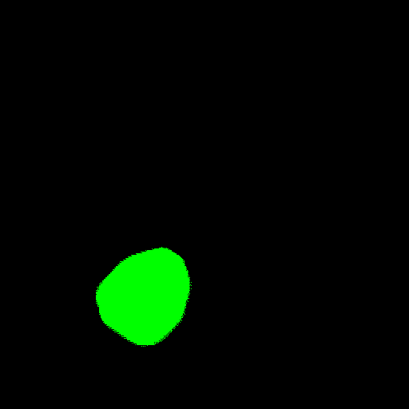</td>
<td>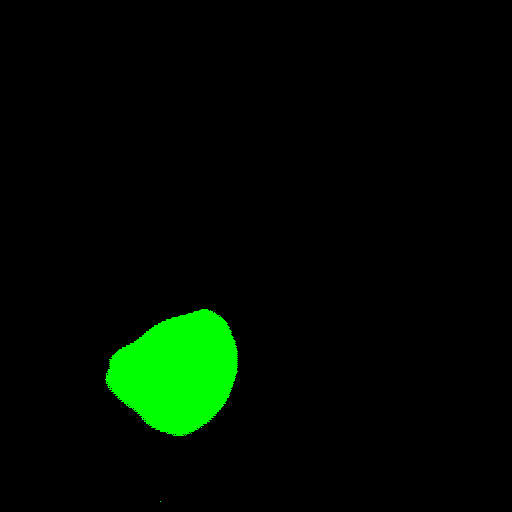</td>
</tr>

<tr>
<td>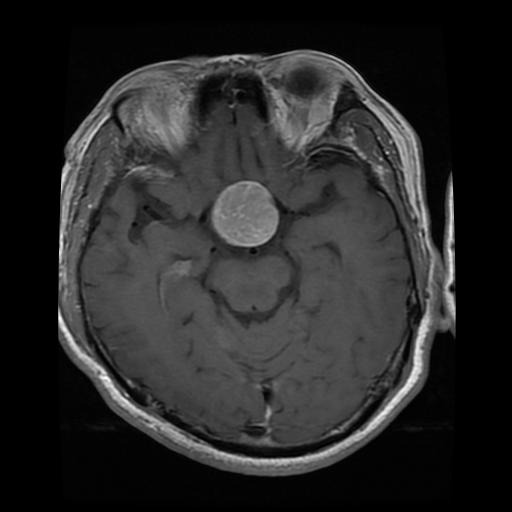</td>
<td></td>
<td></td>
</tr>
</table>

 
<h3>1  Dataset Citation</h3>
The dataset used here was derived from   

<a href="https://www.kaggle.com/datasets/wajeehaldeenaljunaid/mixed-brain-tumor-dataset">
<b>mixed_brain_tumor_dataset</b> 
<b>Brain Tumor MRI Segmentation Dataset (Balanced & Merged)</b> </a> on the kaggle.com.
  
The following explanation was taken from above kaggle web site.
  
<b>Description</b> 
This dataset is a professionally balanced and merged collection of brain tumor MRI images and corresponding segmentation masks. 
 It is derived from two publicly available and credible sources, and reorganized to ensure equal class distribution, 
 making it highly suitable for deep learning tasks like image classification, segmentation, and medical AI research.
  
<b>Source Dataset</b> 
<ul>
<li>1. <a href="https://www.kaggle.com/datasets/atikaakter11/brain-tumor-segmentation-dataset">
Brain Tumor Segmentation Dataset by Atika Akter</a> 
Contains labeled images and masks in four classes: 
0: No Tumor, 1: Glioma, 2: Meningioma, 3: Pituitary 
Format: Images with masks (.jpg) 
Citation: 
<pre>
Akter, A. et al. (2024). Robust clinical applicable CNN and U-Net based algorithm for MRI classification and segmentation for brain tumor. Expert Systems with Applications, 238, 122347.
<a href="https://www.sciencedirect.com/science/article/pii/S095741742302849X?via%3Dihub">[Bibtex]</a>
</pre>
</li>
<li>2. <a href="https://www.kaggle.com/datasets/awsaf49/brain-tumor">Brain Tumor Dataset (MAT Format) by AWSAF49</a>
 
Contains .mat files with T1-weighted contrast-enhanced MR images from 233 patients 
Classes: 1: Meningioma, 2: Glioma, 3: Pituitary 
Additional fields include: tumorMask, tumorBorder, and Patient ID 
</li>
</ul>
<b>Dataset Construction Process</b>
To create a consistent, robust, and balanced dataset: 
<ul>
<li>Data from both datasets were extracted, filtered, and converted into uniform image and mask formats.</li>
<li>All four classes (No Tumor, Glioma, Meningioma, Pituitary) were resampled to 1,595 samples each, including both image and mask.</li>
<li>Images were preprocessed and normalized, masks aligned, and naming conventions unified.</li>
<li>Any class imbalance was addressed by downsampling and filtering based on class labels.</li>
</ul>
<b>Acknowledgements</b> 
Credit goes to the authors and creators of the original datasets for making the data publicly available. This merged and balanced version is intended to help researchers and students build high-quality, tumor detection and segmentation models.
  
<b>License:</b> 
Unknown
  

<h3>
2 Mixed-Brain-Tumor-MRI-Regenerated ImageMask Dataset
</h3>
 If you would like to train this Mixed-Brain-Tumor-MRI-Regenerated Segmentation model by yourself,
please down load our dataset <a href="https://drive.google.com/file/d/1Bk5abVxq3-XkA5d8J4UalO_VcyFUgih3/view?usp=sharing">
<b>Mixed-Brain-Tumor-MRI-Regenerated-ImageMask-Dataset.zip</b>
(<a href="https://www.mit.edu/~amini/LICENSE.md">MIT</a>)
</a> on the google drive,
expand the downloaded, and put it under <b>./dataset/</b> to be.
<pre>
./dataset
└─Mixed-Brain-Tumor-MRI-Regenerated
    ├─test
    │   ├─images
    │   └─masks
    ├─train
    │   ├─images
    │   └─masks
    └─valid
        ├─images
        └─masks
</pre>
 
<b>Mixed-Brain-Tumor-MRI-Regenerated Statistics</b> 
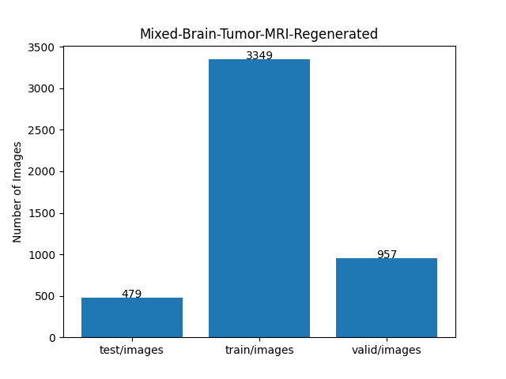 
 
As shown above, the number of images of train and valid datasets is large enough to use for a training set of our segmentation model.
  

The masks of our dataset were regenerated by applying a segmentation (inference) method
of a pretrained <a href="https://github.com/sarah-antillia/TensorFlow-FlexUNet-Image-Segmentation-Model">TensorFlow-FlexUNet-Image-Segmentaion-Model</a> 
trained by the original 
<a href="https://www.kaggle.com/datasets/wajeehaldeenaljunaid/mixed-brain-tumor-dataset">
<b>mixed_brain_tumor_dataset</b> </a> to the original images of the <b>mixed_brain_tumor_dataset</b>.
 
 
<b>Train_images_sample</b> 
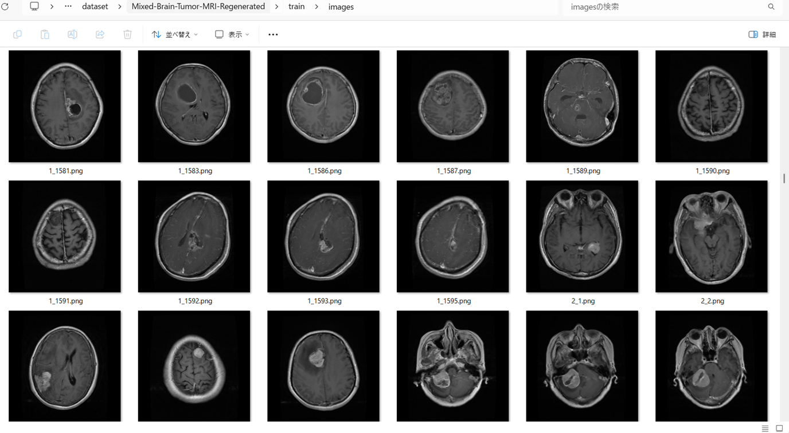
 
<b>Train_masks_sample</b> 
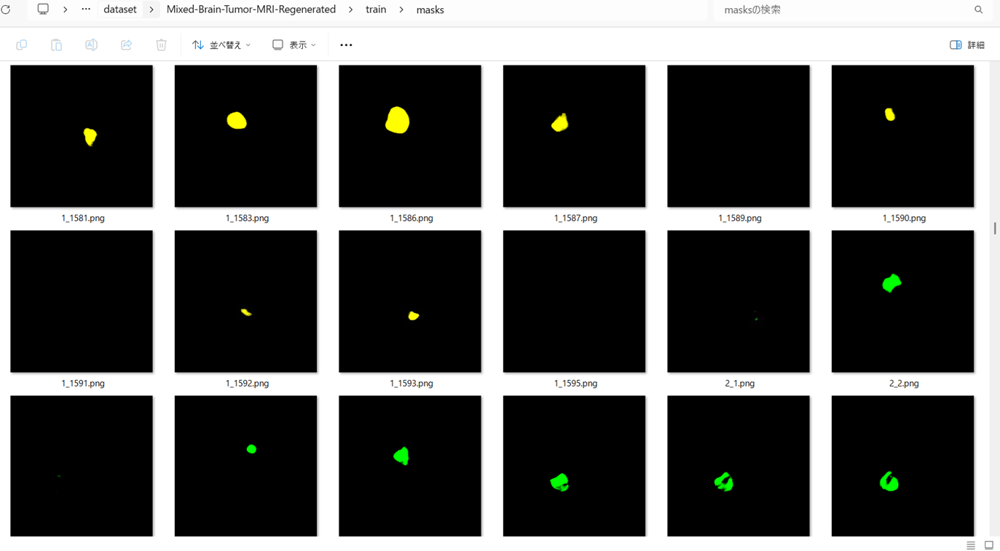
 
<h3>
3 Train TensorflowFlexUNet Model
</h3>
 We trained Mixed-Brain-Tumor-MRI-Regenerated TensorflowFlexUNet Model by using the following
<a href="./projects/TensorFlowFlexUNet/Mixed-Brain-Tumor-MRI-Regenerated/train_eval_infer.config"> <b>train_eval_infer.config</b></a> file.  
Please move to ./projects/TensorFlowFlexUNet/Mixed-Brain-Tumor-MRI-Regenerated and run the following bat file. 
<pre>
>1.train.bat
</pre>
, which simply runs the following command. 
<pre>
>python ../../../src/TensorFlowFlexUNetTrainer.py ./train_eval_infer.config
</pre>

<b>Model parameters</b> 
Defined a small <b>base_filters=16</b> and a large <b>base_kernels=(11,11)</b> for the first Conv Layer of Encoder Block of 
<a href="./src/TensorFlowFlexUNet.py">TensorFlowFlexUNet.py</a> 
and a large num_layers (including a bridge between Encoder and Decoder Blocks).
<pre>
[model]
image_width    = 512
image_height   = 512
image_channels = 3
input_normalize = True
normalization  = False
num_classes    = 4
base_filters   = 16
base_kernels  = (11,11)
num_layers    = 8
dropout_rate   = 0.05
dilation       = (1,1)
</pre>

<b>Learning rate</b> 
Defined a small learning rate.  
<pre>
[model]
learning_rate  = 0.00007
</pre>

<b>Loss and metrics functions</b> 
Specified "categorical_crossentropy" and "dice_coef_multiclass". 
<pre>
[model]
loss           = "categorical_crossentropy"
metrics        = ["dice_coef_multiclass"]
</pre>
<b >Learning rate reducer callback</b> 
Enabled learing_rate_reducer callback, and a small reducer_patience.
<pre> 
[train]
learning_rate_reducer = True
reducer_factor     = 0.5
reducer_patience   = 4
</pre>
<b>Early stopping callback</b> 
Enabled early stopping callback with patience parameter.
<pre>
[train]
patience      = 10
</pre>
<b></b> 
<b>RGB color map</b> 
rgb color map dict for Mixed-Brain-Tumor-MRI-Regenerated 1+3 classes. 
<pre>
[mask]
mask_file_format = ".png"
;Mixed-Brain-Tumor-MRI-Regenerated 1+3
;                   {"Glioma":(255,255,0), "Meningioma":(0,255,0), "Pituitary tumor":(255,0,255)}        
rgb_map = {(0,0,0):0, (255,255,0):1, (0,255,0):2, (255,0,255):3,}       
</pre>
<b>Epoch change inference callbacks</b> 
Enabled epoch_change_infer callback. 
<pre>
[train]
epoch_change_infer       = True
epoch_change_infer_dir   =  "./epoch_change_infer"
epoch_changeinfer        = False
epoch_changeinfer_dir    = "./epoch_changeinfer"
num_infer_images         = 6
</pre>
By using this epoch_change_infer callback, on every epoch_change, the inference procedure can be called
 for 6 images in <b>mini_test</b> folder. This will help you confirm how the predicted mask changes 
 at each epoch during your training process.    
<b>Epoch_change_inference output at starting (1,2,3)</b> 
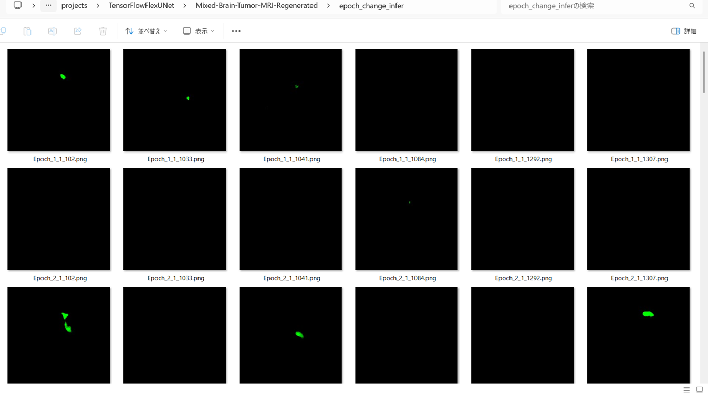 
 
<b>Epoch_change_inference output at middle-point (9,10,11)</b> 
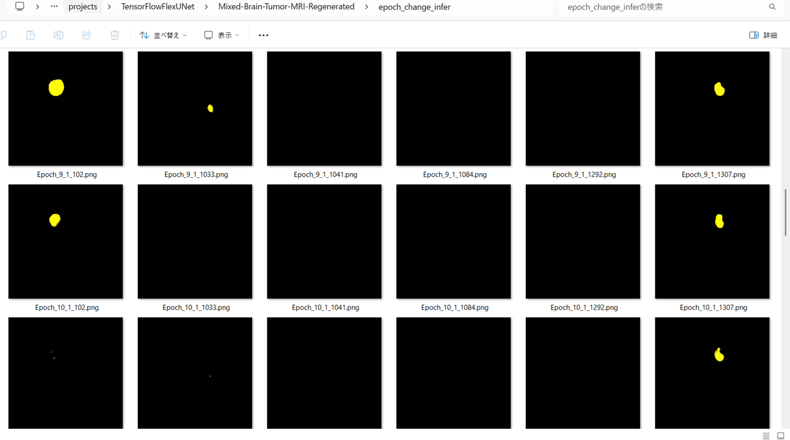 
 
<b>Epoch_change_inference output at ending (20,21,22)</b> 
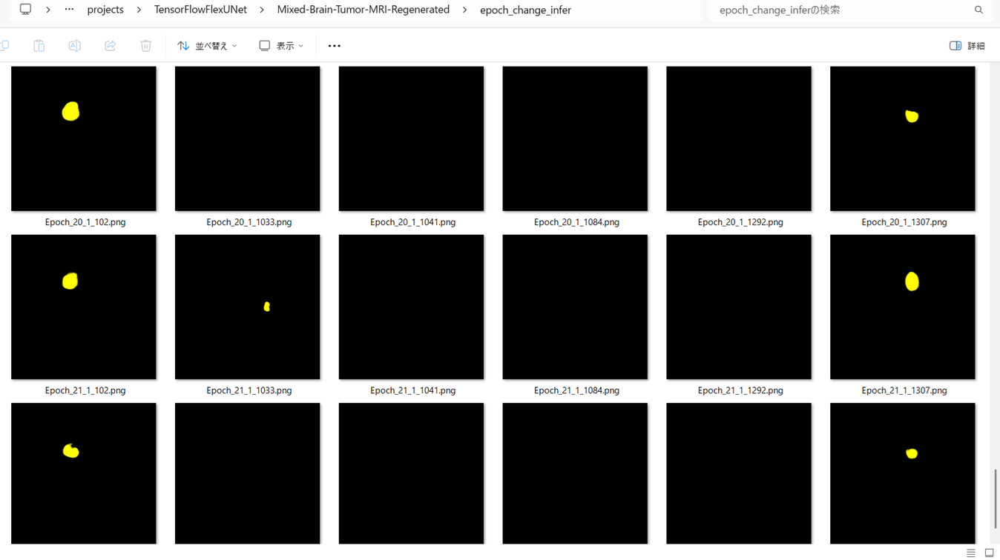 

 
In this experiment, the training process was stopped at epoch 22 by EarlyStoppingCallback.  
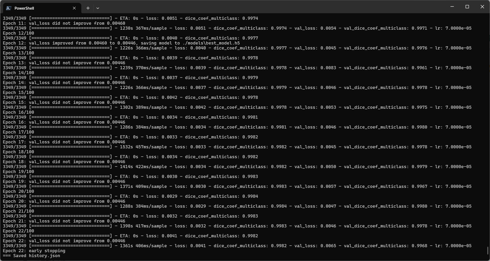 
 
<a href="./projects/TensorFlowFlexUNet/Mixed-Brain-Tumor-MRI-Regenerated/eval/train_metrics.csv">train_metrics.csv</a> 
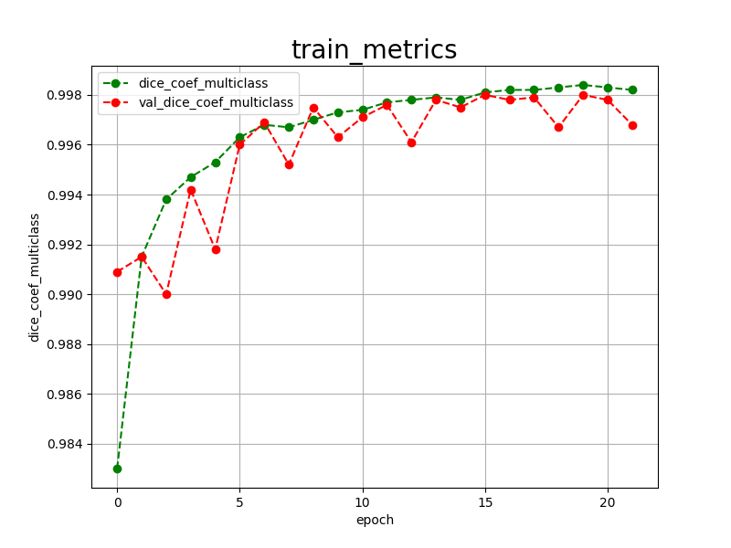 

 
<a href="./projects/TensorFlowFlexUNet/Mixed-Brain-Tumor-MRI-Regenerated/eval/train_losses.csv">train_losses.csv</a> 
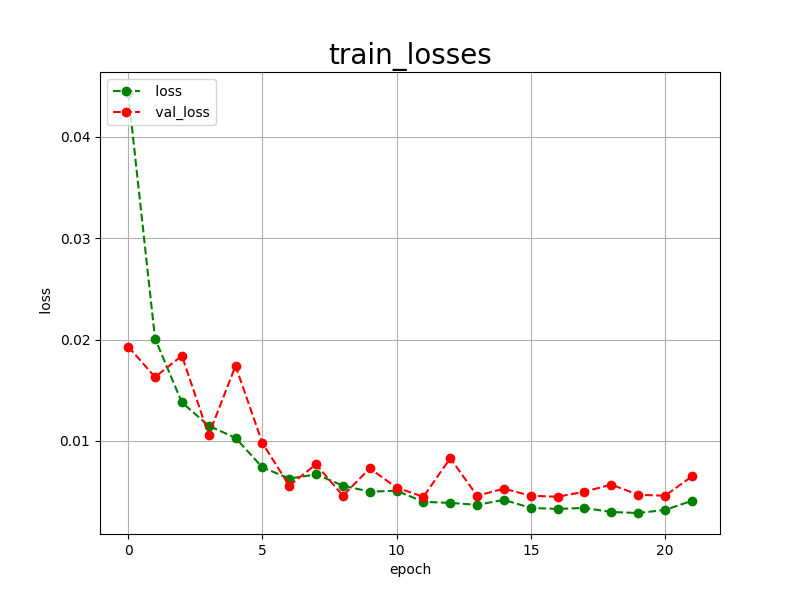 
 
<h3>
4 Evaluation
</h3>
Please move to a <b>./projects/TensorFlowFlexUNet/Mixed-Brain-Tumor-MRI-Regenerated</b> folder, 
and run the following bat file to evaluate TensorflowFlexUNet model for Mixed-Brain-Tumor-MRI-Regenerated. 
<pre>
>./2.evaluate.bat
</pre>
This bat file simply runs the following command.
<pre>
>python ../../../src/TensorFlowFlexUNetEvaluator.py  ./train_eval_infer.config
</pre>
Evaluation console output: 
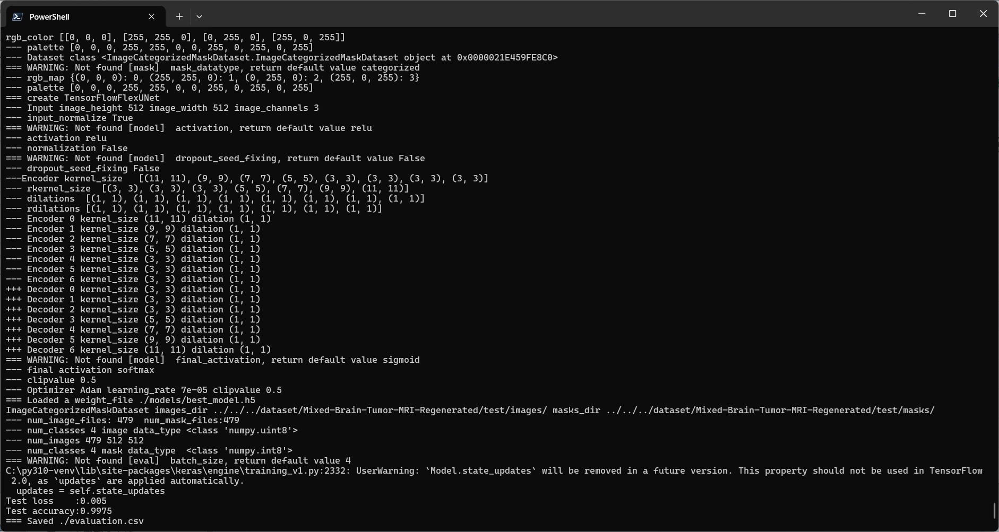
  Image-Segmentation-Mixed-Brain-Tumor-MRI-Regenerated

<a href="./projects/TensorFlowFlexUNet/Mixed-Brain-Tumor-MRI-Regenerated/evaluation.csv">evaluation.csv</a> 
The loss (categorical_crossentropy) to this Mixed-Brain-Tumor-MRI-Regenerated/test was low, and dice_coef_multiclass high as shown below.
 
<pre>
categorical_crossentropy,0.005
dice_coef_multiclass,0.9975
</pre>
 
<h3>5 Inference</h3>
Please move to a <b>./projects/TensorFlowFlexUNet/Mixed-Brain-Tumor-MRI-Regenerated</b> folder 
,and run the following bat file to infer segmentation regions for images by the Trained-TensorflowFlexUNet model for Mixed-Brain-Tumor-MRI-Regenerated. 
<pre>
>./3.infer.bat
</pre>
This simply runs the following command.
<pre>
>python ../../../src/TensorFlowFlexUNetInferencer.py ./train_eval_infer.config
</pre>

<b>mini_test_images</b> 
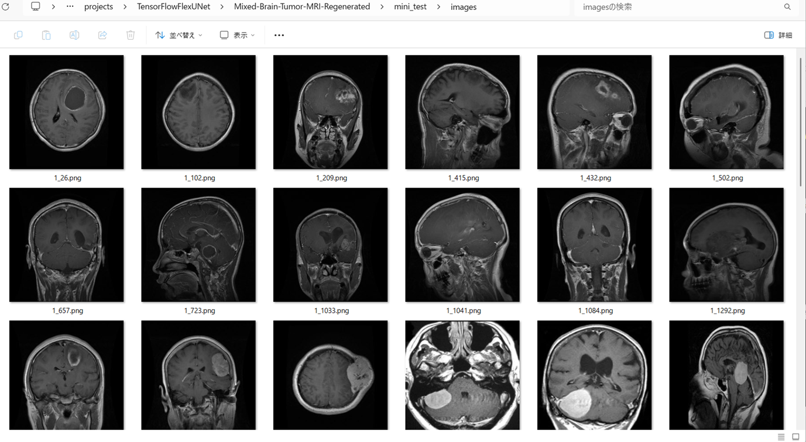 
<b>mini_test_mask(ground_truth)</b> 
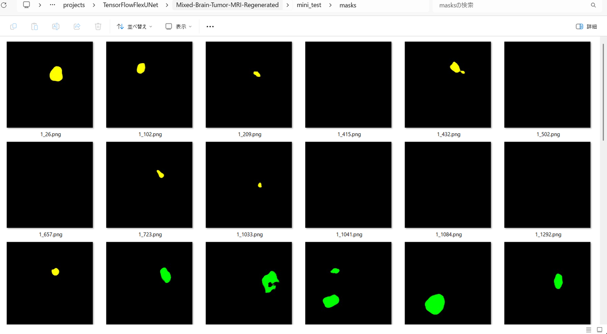 

<b>Inferred test masks</b> 
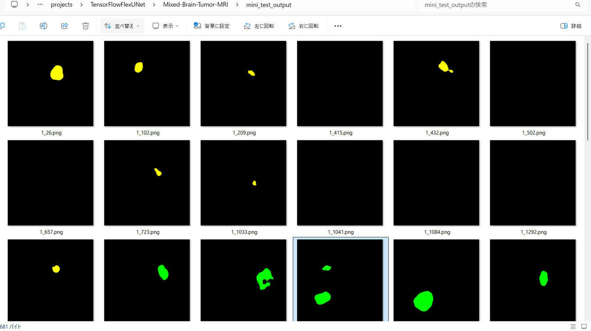 
 

<b>Enlarged images and masks for  Mixed-Brain-Tumor-MRI-Regenerated  Images of 512x512 pixels</b> 
As shown below, the inferred masks predicted by our segmentation model trained by the dataset appear similar to the ground truth masks.
  
<b>class_color_map = {Glioma:yellow,  Meningioma:green, Pituitary: mazenta}</b>
 
 
<table>
<tr>
<th>Input: image</th>
<th>Mask (ground_truth)</th>
<th>Prediction: inferred_mask</th>
</tr>
<tr>
<td>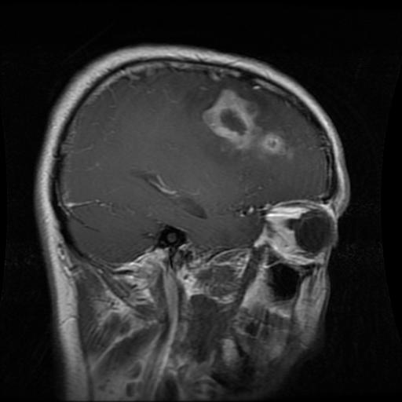</td>
<td>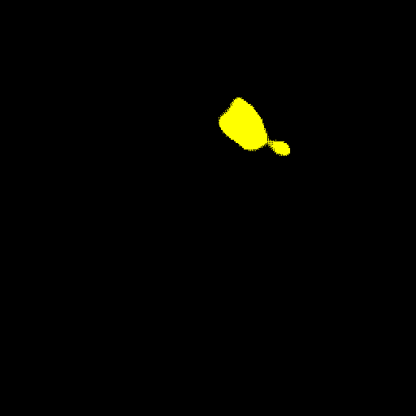</td>
<td>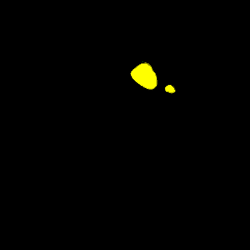</td>
</tr>

<tr>
<td>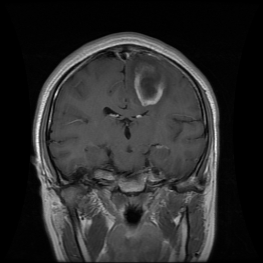</td>
<td></td>
<td></td>
</tr>

<tr>
<td>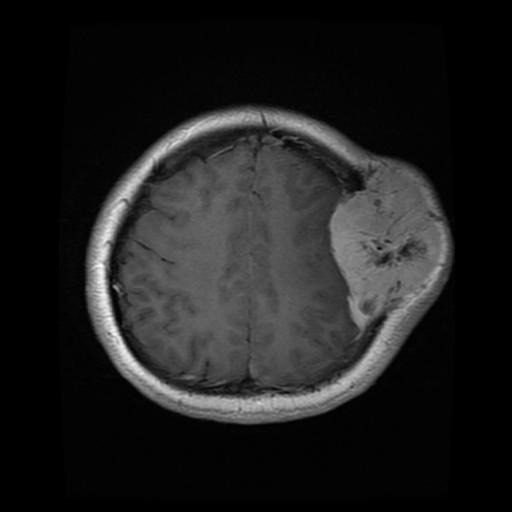</td>
<td>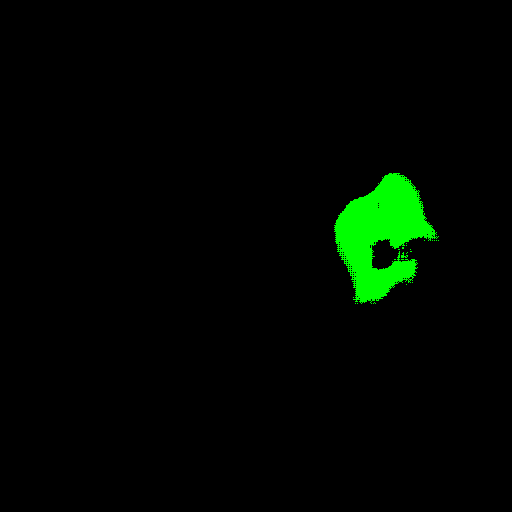</td>
<td>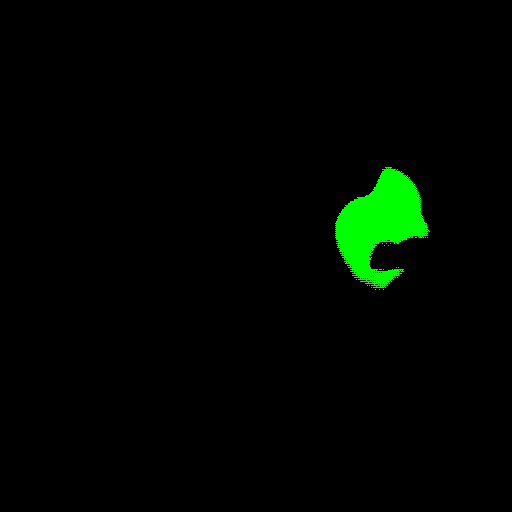</td>
</tr>
<tr>
<td>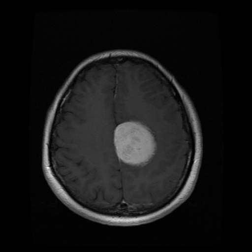</td>
<td>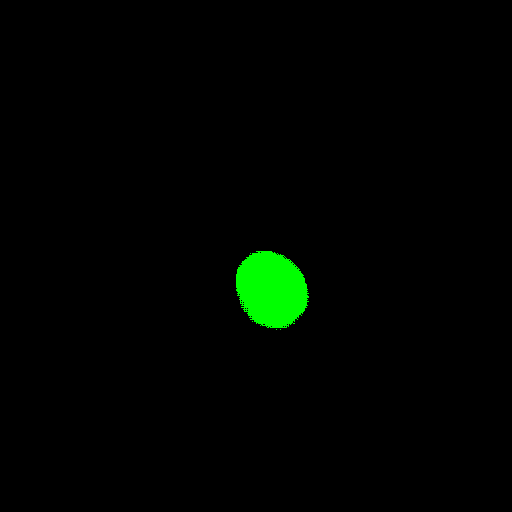</td>
<td></td>
</tr>
<tr>
<td>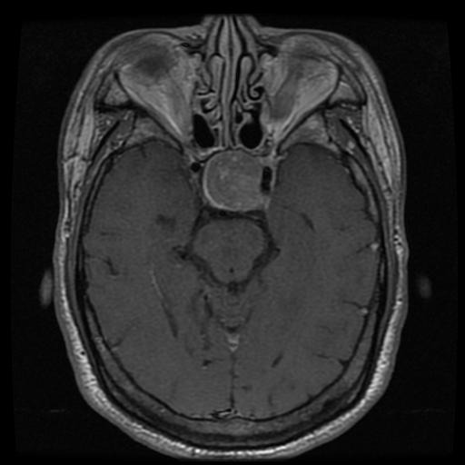</td>
<td></td>
<td>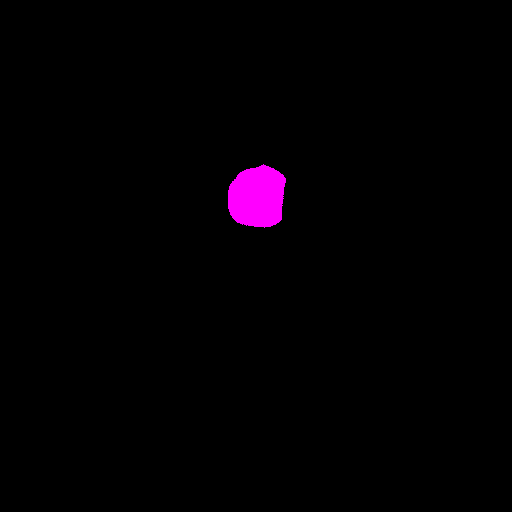</td>
</tr>
<tr>
<td>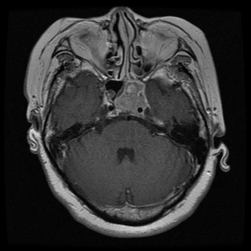</td>
<td>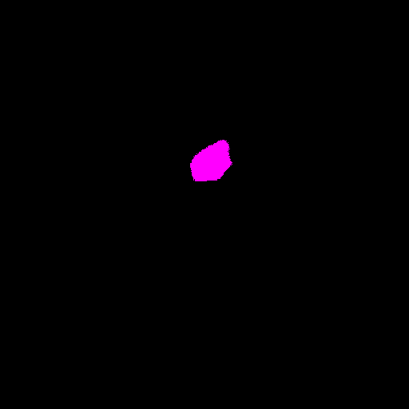</td>
<td></td>
</tr>
</table>

 
<h3>
References
</h3>
<b>1. TensorFlow-FlexUNet-Image-Segmentation-Figshare-BrainTumor</b> 
Toshiyuki Arai  
<a href="https://github.com/sarah-antillia/TensorFlow-FlexUNet-Image-Segmentation-Figshare-BrainTumor">
https://github.com/sarah-antillia/TensorFlow-FlexUNet-Image-Segmentation-Figshare-BrainTumor
</a>
 
 
<b>2. TensorFlow-FlexUNet-Image-Segmentation-BRISC2025-BrainTumor</b> 
Toshiyuki Arai  
<a href="https://github.com/sarah-antillia/TensorFlow-FlexUNet-Image-Segmentation-BRISC2025-BrainTumor">
https://github.com/sarah-antillia/TensorFlow-FlexUNet-Image-Segmentation-BRISC2025-BrainTumor
</a>
 
 
<b>3. TensorFlow-FlexUNet-Image-Segmentation-Brain-Tumor-BraTS2019-HGG-LGG-MRI</b> 
Toshiyuki Arai  
<a href="https://github.com/sarah-antillia/TensorFlow-FlexUNet-Image-Segmentation-Brain-Tumor-BraTS2019-HGG-LGG-MRI">
https://github.com/sarah-antillia/TensorFlow-FlexUNet-Image-Segmentation-Brain-Tumor-BraTS2019-HGG-LGG-MRI
</a>
 
 
<b>4. TensorFlow-FlexUNet-Image-Segmentation-Model</b> 
Toshiyuki Arai  
<a href="https://github.com/sarah-antillia/TensorFlow-FlexUNet-Image-Segmentation-Model">
TensorFlow-FlexUNet-Image-Segmentation-Model
</a>
 
 
